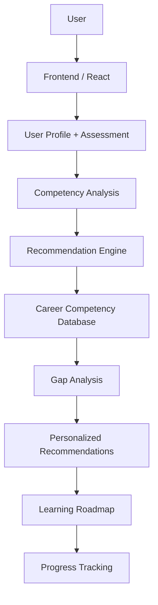

# 1. Project Title

# AI-Based Public Health Competency Recommender

An AI-powered platform that assesses public-health competencies, identifies skill gaps, and recommends personalized competency development pathways.

---

# 2. Project Overview

This project is a responsive web application designed to help students and early-career professionals in public health understand their strengths, identify competency gaps, and plan a more focused learning path. The system supports a user-driven workflow that begins with profile creation, continues through competency assessment, and ends with personalized competency recommendations and a learning roadmap.

The main problem addressed by this project is that many learners in public health do not have a clear understanding of their current competency level or how it compares with the requirements of different career pathways. They may also struggle to select the most important skills to develop next, especially when learning goals are broad and career options are diverse. This application provides a simple, structured way to assess current capability, compare it with career needs, and recommend specific competencies to improve.

This system is useful for:

- Public-health students
- Learners preparing for careers in health informatics, research, surveillance, policy, or data analysis
- Educators who want a practical tool for competency discussion and planning
- Training programs that want a student-centered, skill-based learning approach

Competency development is important in public health because professionals are expected to combine scientific knowledge, data literacy, communication, evidence-based practice, and technical capability. In a field that connects individual health, community health, and systems-level decision-making, a learner needs more than general awareness; they need a clear understanding of which skills are most relevant to their career direction and what to learn next.

The project uses a transparent, rule-based recommendation process. Instead of claiming advanced machine learning in the current prototype, the application compares the learner's competency scores against the requirements of a selected public-health career and recommends the most important skill gaps to address. This makes the system understandable and academically appropriate for a college mini-project.

The website provides a complete user experience that includes:

- Profile setup
- Competency assessment
- Competency scoring
- Dashboard visualization
- Career exploration
- Gap analysis
- Personalized recommendations
- Learning roadmap generation
- Progress tracking

The system follows this workflow:

User Profile
↓
Competency Assessment
↓
Competency Analysis
↓
Career Requirement Matching
↓
Gap Analysis
↓
AI-Based Recommendation
↓
Personalized Learning Roadmap

---

# 3. Problem Statement

Public-health learners often face difficulty in understanding where they stand academically and professionally across the skills required for their desired career paths. In many cases, students may know their interests but do not know their actual competency level in areas such as epidemiology, biostatistics, data analysis, health informatics, research, and communication.

The following challenges are common:

- Understanding current competency level
- Identifying skill gaps in a structured way
- Knowing which competencies are important for different public-health careers
- Deciding what to learn next
- Creating a personalized learning path based on career goals

This project addresses these problems by providing a guided competency assessment, a career-requirement comparison, and a recommendation system that identifies the most relevant development areas. The user can see which competencies are already strong, which ones need improvement, and which learning priorities should be pursued next in order to align with a chosen public-health career.

---

# 4. Objectives

1. Assess public-health competencies.
2. Identify strengths and competency gaps.
3. Compare current competencies with career requirements.
4. Provide personalized competency recommendations.
5. Generate a learning roadmap.
6. Help users monitor competency development.

---

# 5. Key Features

The following features are implemented in the current website and are documented here based on the actual application code.

### User Profile
- User enters name, education level, degree/program, experience, and career goal.
- Interest tags are captured to personalize recommendations.

### Competency Assessment
- A 20-question assessment evaluates public-health knowledge across key competency areas.
- Questions cover epidemiology, biostatistics, data analysis, health informatics, AI/ML, and research.

### Competency Scoring
- Correct answers contribute to the competency score for that domain.
- The application calculates competency levels based on assessment results.

### Competency Dashboard
- Displays overall competency percentage.
- Highlights strengths and development areas.
- Shows competency breakdown using charts and summary cards.

### Career Explorer
- Users can explore multiple public-health career pathways.
- Each career includes a description and required competency profile.

### Gap Analysis
- The system compares current competency against the selected career requirement.
- Positive gaps are visualized as areas requiring improvement.

### AI-Based Recommendations
- The application recommends the highest-priority competency gaps for the selected career.
- Recommendations are ranked by gap size and relevance.

### Learning Roadmap
- Users can add recommended competencies to a roadmap.
- Roadmap items include priority and progress state.

### Progress Tracking
- Roadmap items can be marked as Not Started, In Progress, or Completed.
- The interface tracks completion progress.

---

# 6. Application Screenshots

This repository does not currently include actual screenshot images from the running application. A screenshot folder has been created at `docs/screenshots/` with a placeholder guide for adding them later.

See: `docs/screenshots/README.md`

The following screenshots should be added to the repository in the same folder for a complete project showcase:

1. Home Page
2. User Profile
3. Competency Assessment
4. Assessment Result
5. Competency Dashboard
6. Career Explorer
7. AI Recommendation Page
8. Competency Gap Analysis
9. Learning Roadmap
10. Progress Tracking

Example placeholder naming convention:

- `docs/screenshots/home-page.png`
- `docs/screenshots/user-profile.png`
- `docs/screenshots/competency-assessment.png`
- `docs/screenshots/assessment-result.png`
- `docs/screenshots/competency-dashboard.png`
- `docs/screenshots/career-explorer.png`
- `docs/screenshots/ai-recommendation-page.png`
- `docs/screenshots/competency-gap-analysis.png`
- `docs/screenshots/learning-roadmap.png`
- `docs/screenshots/progress-tracking.png`

The placeholder folder is available in the repository, and the final screenshot links can be updated once the application is captured in a browser.

---

# 7. Technology Stack

| Technology | Purpose |
| --- | --- |
| React | Frontend user interface and interactive views |
| Vite | Development and build tooling |
| JavaScript | Application logic and interactivity |
| Recharts | Data visualization for competency and comparison charts |
| Lucide React | Icons used across the interface |
| CSS | Styling and responsive layout |
| Browser localStorage | Local persistence for profile, scores, roadmap, and assessment state |

---

# 8. System Architecture



---

# 9. System Workflow

### Step 1 — User Profile
User enters education, interests, existing skills, and career goal information.

### Step 2 — Competency Assessment
User answers a set of questions related to public-health competencies.

### Step 3 — Competency Scoring
The system calculates competency scores for each assessed domain.

### Step 4 — Career Selection
User selects a target public-health career such as Epidemiologist or Public Health Data Analyst.

### Step 5 — Gap Analysis
The system compares the current competency level with the requirement for the selected career.

### Step 6 — Recommendation
The recommendation engine identifies the competencies with the largest development gap and highest relevance to the chosen career.

### Step 7 — Learning Roadmap
The system creates a prioritized sequence of competencies for user development.

### Step 8 — Progress
The user tracks their learning status through roadmap updates and progress states.

---

# 10. AI / Recommendation Methodology

The recommendation system in this project is intentionally transparent and works through a rule-based, content-based recommendation approach. It is implemented in the browser using structured data for user performance and career requirements rather than a complex external AI service.

The actual logic follows the application code:

- User competency score: stored as a score for each competency in the `scores` object
- Required career competency: defined in the `careers` data structure for each role
- Competency gap: calculated as the difference between required competency and current competency
- Career relevance: determined by the selected career and its competency requirements
- Priority calculation: based on the magnitude of the gap

The actual formula used in the app is:

`Competency Gap = max(0, Required Competency − Current Competency)`

The application then ranks the gaps as follows:

- High priority: gap >= 35
- Medium priority: gap >= 18
- Low priority: otherwise

This means the recommendation engine compares current assessment results with the selected career profile, identifies the largest opportunity areas, and presents those competencies as the most valuable learning targets.

It is important to note that the current implementation is a prototype and does not rely on advanced machine learning models or live external data feeds. It is best described as a rule-based recommendation system built from structured competency information and user-specific assessment results.

---

# 11. Competency Framework

The current application supports the following competencies.

### Public Health
- Epidemiology
- Research
- Health Informatics

### Data & Statistics
- Biostatistics
- Data Analysis

### Technology
- Python
- SQL
- AI/ML

### Professional Skills
- Communication

These competencies correspond to the actual data values used in the application and the competency assessment questions.

---

# 12. Career Pathways

The application currently includes the following public-health career pathways and their required competencies.

| Career | Required Competencies |
| --- | --- |
| Epidemiologist | Epidemiology, Biostatistics, Data Analysis, Research, Communication |
| Public Health Data Analyst | Python, SQL, Biostatistics, Data Analysis, Epidemiology |
| Health Informatics Specialist | Health Informatics, SQL, Python, Data Analysis, Communication |
| Public Health Researcher | Research, Biostatistics, Epidemiology, Communication, Data Analysis |
| Disease Surveillance Specialist | Epidemiology, Health Informatics, Data Analysis, SQL, Communication |
| Health Policy Analyst | Research, Communication, Biostatistics, Epidemiology, Data Analysis |

---

# 13. Sample Input

The following is a sample user profile and a sample set of competency values. This is not actual user data.

```text
SAMPLE INPUT

Education: Undergraduate
Interest: Epidemiology
Career Goal: Public Health Data Analyst

Current Competencies:
Epidemiology: 70%
Biostatistics: 50%
Python: 35%
SQL: 30%
Data Analysis: 45%
Health Informatics: 60%
```

---

# 14. Sample Output

```text
SAMPLE OUTPUT

Overall Competency: 52%

Strengths:
- Epidemiology
- Health Informatics

Development Areas:
- Python
- SQL
- Biostatistics

Recommended Competencies:
1. Python for Public Health
2. SQL
3. Biostatistics
4. Data Analysis
```

This sample illustrates the type of output the system produces. It is illustrative only and does not represent real user data.

---

# 15. Sample Recommendation

```text
Competency: Python
Current Level: Beginner
Required Level: Advanced
Gap: 45%
Priority: High

Reason:
Python is relevant to the selected Public Health Data Analyst
career pathway and the user's current competency indicates
a significant development gap.
```

This sample reflects the recommendation style used in the application, where each competency gap is explained in context of the selected career pathway.

---

# 16. Demo Walkthrough

# Demo Walkthrough

The following demo sequence is suitable for a 3–5 minute viva or evaluator demonstration:

1. Open the Home Page.
2. Create or enter a User Profile.
3. Select the target career goal.
4. Start the competency assessment.
5. Complete the assessment questions.
6. View the Competency Dashboard.
7. Inspect strengths and development areas.
8. Open the AI Recommendations page.
9. Select recommended competencies and add them to the Learning Roadmap.
10. View the progress tracking section and update roadmap status.

This flow demonstrates the complete user journey from profile creation to career-informed learning planning.

---

# 17. Installation & Setup

The project is a frontend-only React application built with Vite. The setup commands are based on the actual scripts defined in `package.json`.

```bash
git clone <repository-url>
cd <project-folder>
npm install
npm run dev
```

For a production build:

```bash
npm run build
npm run preview
```

These commands match the current project configuration.

---

# 18. Project Structure

```text
project/
│
├── docs/
│   └── screenshots/
│       └── README.md
├── src/
│   ├── App.jsx
│   ├── main.jsx
│   └── styles.css
├── index.html
├── package.json
├── package-lock.json
├── vite.config.js
├── postcss.config.js
├── tailwind.config.js
├── README.md
└── .gitignore
```

---

# 19. Application Architecture

### Frontend
The frontend is responsible for user interface, forms, navigation, assessment flow, dashboard visualizations, career comparison, and roadmap management.

### Recommendation Engine
The recommendation engine analyzes user competency scores, compares them with selected career requirements, and ranks the largest competency gaps that should be addressed next.

### Data Layer
The application stores structured competency and career data locally in the browser using `localStorage`. This includes the user profile, assessment state, computed scores, and roadmap items.

### Visualization
The app uses charts to display overall competency, competency distribution, and comparison between current skills and required career competencies.

---

# 20. Reference Paper

# Reference Paper

**Title:** "Artificial Intelligence in Public Health Education: A Scoping Review of Workforce Competency Development"

**Authors:** Semi et al.

**Journal:** Health Science Reports

**Year:** 2026

**Reference Note:** This project was conceptually inspired by the growing discussion of AI-supported competency development in public-health education. The exact paper details (DOI, publisher URL, and formal bibliographic metadata) should be verified before final academic submission.

[Add verified DOI/publisher URL here]

---

# 21. Relationship Between Research Paper and Project

The research paper provides the conceptual foundation for understanding how artificial intelligence and competency-based education can support workforce development in public health. This project translates that idea into a practical prototype by allowing a learner to assess their competency, compare it with career requirements, and receive targeted recommendations for improvement.

In other words, the research concept is centered on AI and competency development in public-health education, while the project implements a simplified web-based prototype for assessment, gap analysis, and personalized learning guidance. The application demonstrates how AI-supported recommendation logic can be incorporated into a student-friendly, career-oriented digital learning experience.

---

# 22. Sample Use Case

### Student wants to become a Public Health Data Analyst

Current skills:

- Basic epidemiology
- Beginner Python
- Beginner SQL
- Intermediate communication

The system:

1. Assesses competencies.
2. Identifies gaps.
3. Compares them with career requirements.
4. Recommends Python, SQL, statistics, and data analysis.
5. Creates a learning sequence.

This reflects how the application supports career-oriented competency planning for a student in public health.

---

# 23. Expected Benefits

The system can help in several meaningful ways:

- Public-health students can evaluate their current skill level and identify areas for improvement.
- Educators can use the tool to discuss competency development and learning priorities.
- Training programs can personalize learning support based on career goals.
- Career development becomes more informed through a direct comparison of skills and role requirements.
- Competency-based learning is supported through structured assessment and feedback.
- Personalized learning is improved by ranking recommendations according to relevance and development need.

These benefits are realistic for a prototype application focused on transparent, student-centered guidance.

---

# 24. Limitations

This project is a working prototype and has realistic limitations:

- Recommendations depend on the competency data currently available in the application.
- The assessment questions are limited to the current question set.
- Career requirements may vary across organizations and public-health roles.
- Recommendations should be treated as guidance rather than professional career decisions.
- External labor-market data is not incorporated in the current application.
- The system uses structured, sample-based competency data rather than large-scale real-world datasets.

---

# 25. Future Scope

The project can be extended in several useful directions:

- Larger public-health competency database
- Real-world competency frameworks
- More career pathways
- Adaptive assessments
- LLM-powered explanations for recommendations
- Integration with learning platforms
- Real-time labor-market skill data
- Multilingual support
- Mobile application development
- Teacher or institutional dashboard
- Advanced machine learning recommendation models

These improvements would move the prototype beyond a local educational web app toward a more robust real-world competency guidance system.

---

# 26. Student Details

# Student Details

**Name:** Krish Tribhuwan Albert  
**Roll No.:** 5024133  
**Department:** Information Technology  
**Institute:** Fr. C. Rodrigues Institute of Technology (FCRIT), Vashi  
**Academic Year:** 2026–27

| Student | Roll No. | Department |
| --- | --- | --- |
| Krish Tribhuwan Albert | 5024133 | Information Technology |

---

# 27. Project Status

**Status: Working Prototype**

The current version of the project is a functional prototype that demonstrates:

- user profile entry
- a competency assessment
- score calculation and dashboard evaluation
- career comparison
- gap analysis
- AI-style recommendations
- roadmap creation and progress tracking

The project is suitable for demo, academic evaluation, and further development.

---

# 28. Demo

# Live Demo

Live demo link will be added after deployment.

---

# 29. Repository Contents

The repository contains the core files needed to run and present the project:

- `src/App.jsx` contains the main application logic, assessment flow, recommendation engine, and dashboard components.
- `src/main.jsx` mounts the React application in the browser.
- `src/styles.css` contains the styling and layout for the dashboard, cards, forms, and responsive interface.
- `index.html` provides the root web page for Vite.
- `package.json` contains the project scripts and dependencies.
- `docs/screenshots/README.md` provides a placeholder for screenshots and demo assets.
- `README.md` documents the project for academic review.

---

# 30. License

License: Academic/educational project.

---

